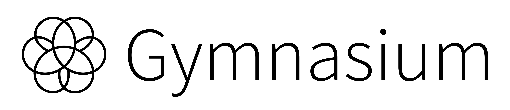

[](https://pre-commit.com/) [](https://github.com/psf/black)

<p align="center">
    
</p>

## Gymnasium

Gymnasium is an open source Python library for developing and comparing reinforcement learning algorithms by providing a standard API to communicate between learning algorithms and environments, as well as a standard set of environments compliant with that API. This is a fork of OpenAI's Gym library by the maintainers, and is where future maintenance will occur going forward

The documentation website is at [gymnasium.farama.org](https://gymnasium.farama.org), and we have a public discord server (which we also use to coordinate development work) that you can join here: https://discord.gg/nHg2JRN489

## Installation

To install the base Gymnasium library, use `pip install gymnasium`.

This does not include dependencies for all families of environments (there's a massive number, and some can be problematic to install on certain systems). You can install these dependencies for one family like `pip install gymnasium[atari]` or use `pip install gymnasium[all]` to install all dependencies.

We support and test for Python 3.7, 3.8, 3.9 and 3.10 on Linux and macOS. We will accept PRs related to Windows, but do not officially support it.

## API

The Gymnasium API models environments as simple Python `env` classes. Creating environment instances and interacting with them is very simple- here's an example using the "CartPole-v1" environment:

```python
import gymnasium as gym
env = gym.make("CartPole-v1")

observation, info = env.reset(seed=42)
for _ in range(1000):
    action = env.action_space.sample()
    observation, reward, terminated, truncated, info = env.step(action)

    if terminated or truncated:
        observation, info = env.reset()
env.close()
```

## Notable Related Libraries

* [Stable Baselines 3](https://github.com/DLR-RM/stable-baselines3) is a learning library based on the Gym API. It is designed to cater to complete beginners in the field who want to start learning things quickly.
* [RL Baselines3 Zoo](https://github.com/DLR-RM/rl-baselines3-zoo) builds upon SB3, containing optimal hyperparameters for Gym environments as well as code to easily find new ones.
* [Tianshou](https://github.com/thu-ml/tianshou) is a learning library that's geared towards very experienced users and is design to allow for ease in complex algorithm modifications.
* [RLlib](https://docs.ray.io/en/latest/rllib/index.html) is a learning library that allows for distributed training and inference and supports an extraordinarily large number of features throughout the reinforcement learning space.
* [PettingZoo](https://github.com/Farama-Foundation/PettingZoo) is like Gymnasium, but for environments and an API multiple agents.

## Environment Versioning

Gymnasium keeps strict versioning for reproducibility reasons. All environments end in a suffix like "\_v0".  When changes are made to environments that might impact learning results, the number is increased by one to prevent potential confusion. These inherent from Gym.


## Development Roadmap

We have a roadmap for future development work for Gymnasium available here:: https://github.com/Farama-Foundation/Gymnasium/issues/12


## Release Notes

There used to be release notes for all the new Gym versions here. New release notes are being moved to [releases page](https://github.com/Farama-Foundation/Gymnasium/releases) on GitHub, like most other libraries do.
