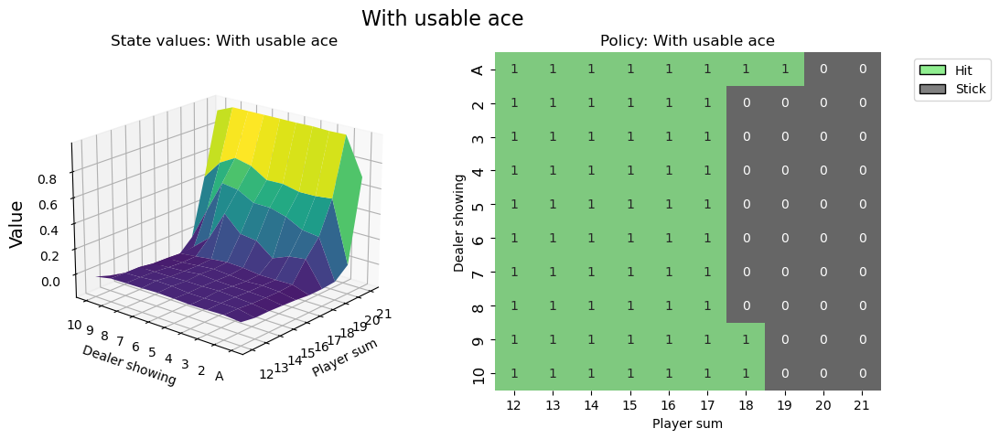
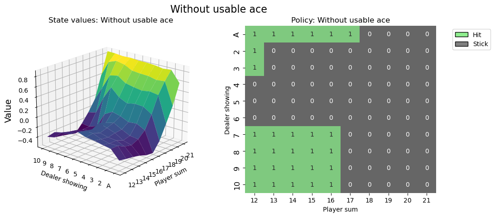

# Training an Agent

This page provides a short outline of how to train an agent for a Gymnasium environment, in particular, we will use a tabular based Q-learning to solve the Blackjack v1 environment. For a full complete version of this tutorial and more training tutorials for other environments and algorithm, see [this](../tutorials/training_agents). Please read [basic usage](basic_usage) before reading this page. Before we implement any code, here is an overview of Blackjack and Q-learning.

Blackjack is one of the most popular casino card games that is also infamous for being beatable under certain conditions. This version of the game uses an infinite deck (we draw the cards with replacement), so counting cards won't be a viable strategy in our simulated game. The observation is a tuple of the player's current sum, the value of the dealers face-up card and a boolean value on whether the player holds a usable case. The agent can pick between two actions: stand (0) such that the player takes no more cards and hit (1) such that the player will take another player. To win, your card sum should be greater than the dealers without exceeding 21. The game ends if the player selects stand or if the card sum is greater than 21. Full documentation can be found at [https://gymnasium.farama.org/environments/toy_text/blackjack](https://gymnasium.farama.org/environments/toy_text/blackjack).

Q-learning is a model-free off-policy learning algorithm by Watkins, 1989 for environments with discrete action spaces and was famous for being the first reinforcement learning algorithm to prove convergence to an optimal policy under certain conditions.

## Executing an action

After receiving our first observation, we are only going to use the``env.step(action)`` function to interact with the environment. This function takes an action as input and executes it in the environment. Because that action changes the state of the environment, it returns four useful variables to us. These are:

 -  ``next observation``: This is the observation that the agent will receive after taking the action.
 -  ``reward``: This is the reward that the agent will receive after taking the action.
 -  ``terminated``: This is a boolean variable that indicates whether or not the environment has terminated, i.e., ended due to an internal condition.
 -  ``truncated``: This is a boolean variable that also indicates whether the episode ended by early truncation, i.e., a time limit is reached.
 -  ``info``: This is a dictionary that might contain additional information about the environment.

The ``next observation``, ``reward``, ``terminated`` and ``truncated`` variables are self-explanatory, but the ``info`` variable requires some additional explanation. This variable contains a dictionary that might have some extra information about the environment, but in the Blackjack-v1 environment you can ignore it. For example in Atari environments the info dictionary has a ``ale.lives`` key that tells us how many lives the agent has left. If the agent has 0 lives, then the episode is over.

Note that it is not a good idea to call ``env.render()`` in your training loop because rendering slows down training by a lot. Rather try to build an extra loop to evaluate and showcase the agent after training.

## Building an agent

Let's build a Q-learning agent to solve Blackjack! We'll need some functions for picking an action and updating the agents action values. To ensure that the agents explores the environment, one possible solution is the epsilon-greedy strategy, where we pick a random action with the percentage ``epsilon`` and the greedy action (currently valued as the best) ``1 - epsilon``.

```python
from collections import defaultdict
import gymnasium as gym
import numpy as np


class BlackjackAgent:
    def __init__(
        self,
        env: gym.Env,
        learning_rate: float,
        initial_epsilon: float,
        epsilon_decay: float,
        final_epsilon: float,
        discount_factor: float = 0.95,
    ):
        """Initialize a Reinforcement Learning agent with an empty dictionary
        of state-action values (q_values), a learning rate and an epsilon.

        Args:
            env: The training environment
            learning_rate: The learning rate
            initial_epsilon: The initial epsilon value
            epsilon_decay: The decay for epsilon
            final_epsilon: The final epsilon value
            discount_factor: The discount factor for computing the Q-value
        """
        self.env = env
        self.q_values = defaultdict(lambda: np.zeros(env.action_space.n))

        self.lr = learning_rate
        self.discount_factor = discount_factor

        self.epsilon = initial_epsilon
        self.epsilon_decay = epsilon_decay
        self.final_epsilon = final_epsilon

        self.training_error = []

    def get_action(self, obs: tuple[int, int, bool]) -> int:
        """
        Returns the best action with probability (1 - epsilon)
        otherwise a random action with probability epsilon to ensure exploration.
        """
        # with probability epsilon return a random action to explore the environment
        if np.random.random() < self.epsilon:
            return self.env.action_space.sample()
        # with probability (1 - epsilon) act greedily (exploit)
        else:
            return int(np.argmax(self.q_values[obs]))

    def update(
        self,
        obs: tuple[int, int, bool],
        action: int,
        reward: float,
        terminated: bool,
        next_obs: tuple[int, int, bool],
    ):
        """Updates the Q-value of an action."""
        future_q_value = (not terminated) * np.max(self.q_values[next_obs])
        temporal_difference = (
            reward + self.discount_factor * future_q_value - self.q_values[obs][action]
        )

        self.q_values[obs][action] = (
            self.q_values[obs][action] + self.lr * temporal_difference
        )
        self.training_error.append(temporal_difference)

    def decay_epsilon(self):
        self.epsilon = max(self.final_epsilon, self.epsilon - self.epsilon_decay)
```

## Training the agent

To train the agent, we will let the agent play one episode (one complete game is called an episode) at a time and then update it's Q-values after each episode. The agent will have to experience a lot of episodes to explore the environment sufficiently.

```python
# hyperparameters
learning_rate = 0.01
n_episodes = 100_000
start_epsilon = 1.0
epsilon_decay = start_epsilon / (n_episodes / 2)  # reduce the exploration over time
final_epsilon = 0.1

agent = BlackjackAgent(
    learning_rate=learning_rate,
    initial_epsilon=start_epsilon,
    epsilon_decay=epsilon_decay,
    final_epsilon=final_epsilon,
)
```

Info: The current hyperparameters are set to quickly train a decent agent. If you want to converge to the optimal policy, try increasing the ``n_episodes`` by 10x and lower the learning_rate (e.g. to 0.001).

```python
from tqdm import tqdm

env = gym.make("Blackjack-v1", sab=False)
env = gym.wrappers.RecordEpisodeStatistics(env, deque_size=n_episodes)

for episode in tqdm(range(n_episodes)):
    obs, info = env.reset()
    done = False

    # play one episode
    while not done:
        action = agent.get_action(obs)
        next_obs, reward, terminated, truncated, info = env.step(action)

        # update the agent
        agent.update(obs, action, reward, terminated, next_obs)

        # update if the environment is done and the current obs
        done = terminated or truncated
        obs = next_obs

    agent.decay_epsilon()
```


## Visualising the policy





Hopefully this tutorial helped you get a grip of how to interact with Gymnasium environments and sets you on a journey to solve many more RL challenges.

It is recommended that you solve this environment by yourself (project based learning is really effective!). You can apply your favorite discrete RL algorithm or give Monte Carlo ES a try (covered in `Sutton & Barto <http://incompleteideas.net/book/the-book-2nd.html>`_, section 5.3) - this way you can compare your results directly to the book.

Best of luck!
